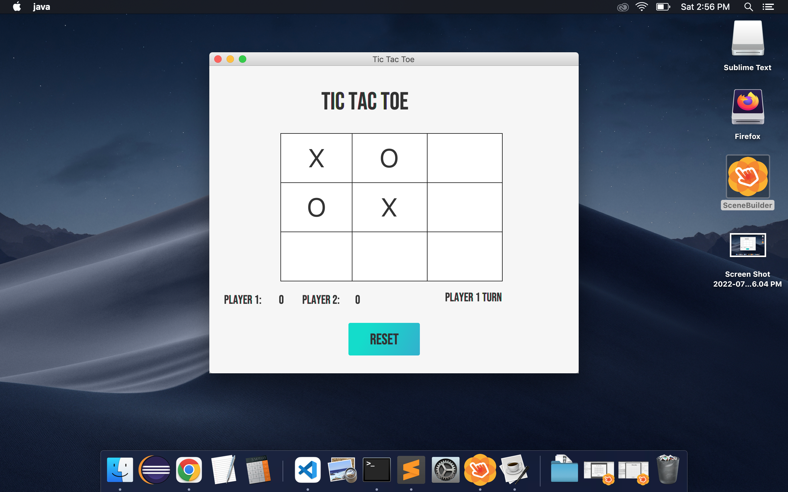
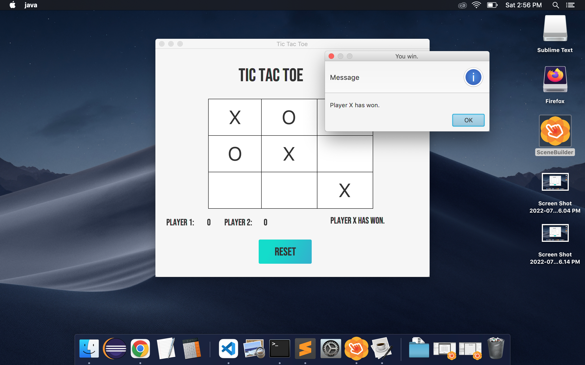
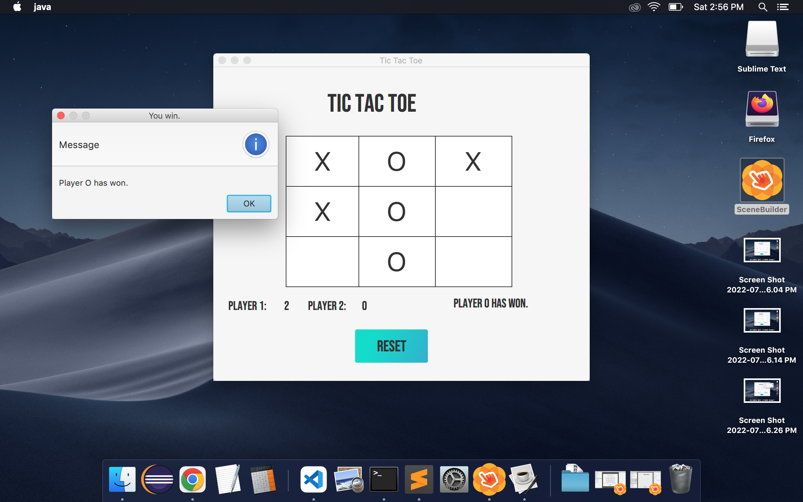

# JavaFX Tic Tac Toe

## About
---

A Cross-platform Tic Tac Toe application built using JavaFX.

The goal of Tic Tac Toe is to place three consecutive spots first. To win the spots can be consecutive diagonally, by row, or by column. 

## Requirements
---

This project was built using JavaFX and therefore requires the Java SDK(version 9+) to run the provided executable. To edit the project the javaFX libraries must also be installed and in a lib folder.

 
- [Java SDK Version 9+](https://www.oracle.com/java/technologies/downloads/)

- [JavaFX](https://openjfx.io/)

## Usage 
---

 Images:
  
  
  

Styling of the game is handled by `application.css`. Custom changes can be added by following the [JavaFX css reference](https://docs.oracle.com/javase/8/javafx/api/javafx/scene/doc-files/cssref.html). 

To add more functionality feel free to edit `Controller.java`. 

Below are useful links to get started on JavaFX
 - [Code.makery JavaFX guide](https://code.makery.ch/library/javafx-tutorial/)
 - [Tutorialspoint JavaFX guide](https://www.tutorialspoint.com/javafx/javafx_application.htm)

 ### Author
 ---

 Christopher Perez

